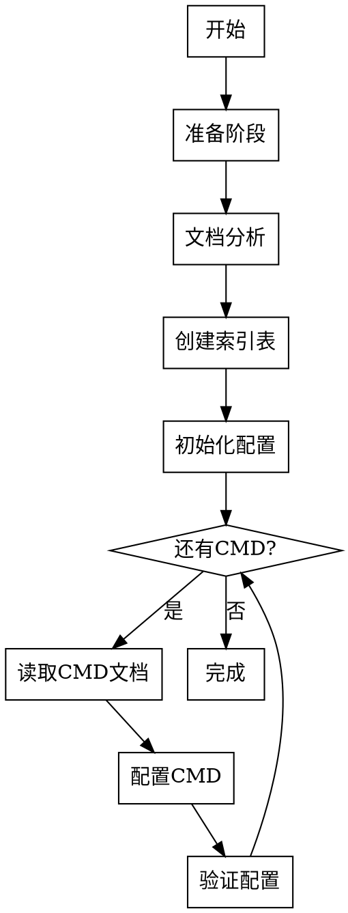

# 协议到 YAML 配置工作流

本工作流用于将协议文档转换为 V8Parse 的 YAML 配置文件。

## Overview

**核心问题解决：** 解决大型协议配置时因上下文溢出导致的记忆不准确问题。

**核心原则：**

1. **分阶段处理** - 准备 → 分析 → 初始化 → 配置 → 验证
2. **逐 CMD 配置** - 每次只配置一个 CMD，配置前重新读取文档
3. **按需添加** - 仅添加实际使用的类型和枚举，避免冗余
4. **TODO 标记** - 无法配置的 CMD 明确标记原因和待解决问题

## When to Use

✅ **使用场景：**

- 需要将协议文档转换为 V8Parse YAML 配置文件
- 协议包含多个 CMD（>10 个）需要分阶段配置
- 协议文档过长（>1000 行）可能导致上下文溢出
- 需要逐 CMD 配置并验证配置正确性

❌ **不适用于：**

- 协议文档已转换为 YAML 配置
- 协议只有少量 CMD（<5 个）可直接一次性配置
- 非 V8Parse 项目的配置转换

## Quick Reference

| 阶段 | 核心任务 | 关键输出 |
| :--- | :--- | :--- |
| **准备工作** | 确认文档位置、创建目录、读取模板 | 协议配置目录 |
| **文档分析** | 读取文档前 200 行、提取 CMD 索引 | CMD 索引表 |
| **初始化配置** | 创建基础 YAML 结构 | protocol.yaml |
| **逐 CMD 配置** | 读取 CMD 文档、分析字段、编写配置 | 完整的 cmds 定义 |
| **验证测试** | 运行验证、解析测试、检查输出 | 可用的配置文件 |

## Configuration Workflow



## Phase 1: 准备工作

### 1.1 确认协议文档位置

用户需提供协议文档路径，通常位于 `protocoltxt/` 目录下。

### 1.2 创建协议配置目录

```bash
mkdir -p configs/<protocol_name>
```

### 1.3 读取配置模板

读取 `configs/protocol_template.yaml` 了解完整的配置规范。

## Phase 2: 文档分析（必须先完成）

### 2.1 读取协议文档目录结构

**首先读取协议文档的前 200 行**，获取目录和 CMD 分布概览。

### 2.2 提取 CMD 索引表

从目录中提取所有 CMD 及其在文档中的位置，创建索引表：

| CMD编号 | 命令名称 | 文档行号范围 | 配置状态 |
| :--- | :--- | :--- | :--- |
| 1 | xxx | 100-150 | 待配置 |
| 2 | xxx | 151-200 | 待配置 |
| 99 | xxx | 500-550 | TODO |

**配置状态说明：**

- **待配置** - 尚未处理
- **已配置** - 配置完成
- **TODO** - 无法配置，需要人工处理

### 2.3 分析协议基本信息

从文档中提取：
- 帧头格式（frame_head）
- 报文头长度（head_len）
- 报文尾长度（tail_len）
- 头部字段定义（head_fields）
- 默认字节序（default_endian）

## Phase 3: 初始化 YAML 配置

### 3.1 创建基础配置结构

基于阶段二的分析，创建 `configs/<protocol_name>/protocol.yaml` 的基础结构：

```yaml
meta:
  protocol: <protocol_name>
  version: 1
  default_endian: LE  # 或 BE
  notes: <协议说明>

compatibility:
  head_len: <头部长度>
  tail_len: <尾部长度>
  frame_head: <帧头值>
  head_fields: []

types: {}
enums: {}
cmds: []
filters:
  exclude_cmds: []
```

详见 [config_guide.md](references/config_guide.md) 获取完整配置规范。

## Phase 4: 逐 CMD 配置（核心阶段）

⚠️ **重要原则：**
1. **每次只配置一个 CMD**
2. **配置前必须重新读取该 CMD 对应的文档位置**
3. **按需添加 types 和 enums，避免冗余**
4. **无法配置时明确标记 TODO**

### 4.1 CMD 配置循环

对于每个待配置的 CMD，执行以下步骤：

### 步骤 A：读取文档中的 CMD 定义

读取文件: `protocoltxt/<协议文档>.md`
行范围: `<该CMD的起始行>-<该CMD的结束行>`

### 步骤 B：分析字段列表

从文档中提取所有字段信息，记录：

- 字段名称
- 字段长度
- 数据类型
- 枚举映射（如有）
- 特殊处理（循环、条件字段等）

### 步骤 C：编写 YAML 配置

使用以下模板：

```yaml
- cmd: <CMD编号>
  name: <命令名称>
  fields:
    - {len: <长度>, name: <字段名>, type: <类型>}
    # ... 更多字段
```

详见 [config_guide.md](references/config_guide.md) 获取字段配置详细规范。

### 4.2 配置 TODO 标记

对于无法配置的 CMD，在索引表中标记为 TODO 并记录原因：

| CMD编号 | TODO 原因 | 待解决问题 |
| :--- | :--- | :--- |
| 99 | 缺少字段长度定义 | 需要人工补充或等待文档更新 |

## Phase 5: 验证测试

### 5.1 运行配置验证

```bash
# 验证配置语法
python main.py --validate
```

### 5.2 运行解析测试

如果有测试日志：

```bash
python main.py <protocol_name>
```

检查点：
- [ ] 解析过程无报错
- [ ] 所有 CMD 都能被识别
- [ ] 输出文件正常生成

## Common Mistakes

| 错误 | 后果 | 修正 |
| :--- | :--- | :--- |
| 一次性复制所有类型定义 | 产生大量未使用的类型定义 | 按需添加，仅添加实际使用的类型 |
| 配置前不重新读取文档 | 因上下文溢出导致字段配置错误 | 每次配置 CMD 前重新读取对应文档位置 |
| 忽略 TODO 标记 | 无法区分未配置和不可配置的 CMD | 明确标记不可配置的 CMD 及原因 |
| 验证频率过低 | 累积错误导致难以定位问题 | 每配置 5 个 CMD 验证一次 |
| 字段名使用 id 但未定义 | repeat_by/len_by 无法引用 | 必须为被引用字段添加 id 属性 |

## Detailed References

**配置规范：**

- **[config_guide.md](references/config_guide.md)** - 完整的 YAML 配置规范（字段类型、循环结构、条件字段等）

**模板和示例：**

- **[protocol_template.yaml](../../configs/protocol_template.yaml)** - 完整的配置模板
- **[v8/protocol.yaml](../../configs/v8/protocol.yaml)** - 参考现有配置

**相关技能：**

- **[yaml-config-review](../yaml-config-review/SKILL.md)** - YAML 配置审查工作流

## Red Flags - STOP

- "我直接复制所有类型定义，省事"
- "刚才读过的文档，不用再读了吧"
- "这个 CMD 配不了，先跳过"
- "配置完了再一起验证吧"

**所有这些都意味着：停止当前工作，重新遵循正确的配置流程。**
