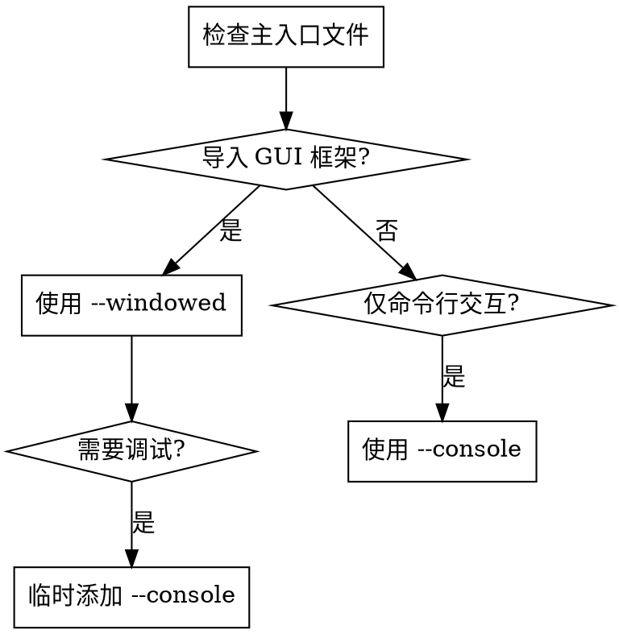

# PyInstaller 打包规范

统一 Python 应用打包流程，解决 ModuleNotFoundError、资源文件缺失等常见问题。

## Overview

**核心原则：**

1. **路径兼容性优先** - 必须处理 `sys._MEIPASS`
2. **依赖固定版本** - 避免版本差异导致打包失败
3. **平台差异处理** - Windows/Unix 路径分隔符不同
4. **资源文件打包** - 使用 `--add-data` 包含所有资源

## When to Use

✅ **使用场景：**

- 创建 Python 应用的独立可执行文件（.exe、binary）
- 排查 PyInstaller 构建错误（ModuleNotFoundError、FileNotFoundError）
- 打包包含配置文件、图片、数据等资源的应用
- 构建 GUI 应用（tkinter、PyQt、PySide）或 CLI 工具
- 处理跨平台构建（Windows/macOS/Linux）

❌ **不适用于：**

- 创建 Python wheels 或 sdists（使用 `setuptools`/`poetry`）
- Docker 容器化（使用 `docker build`）
- 代码签名或分发（这是打包后的步骤）

## Quick Reference

| 应用类型 | 命令示例 | 关键参数 |
| :--- | :--- | :--- |
| **GUI 应用** | `pyinstaller --onefile --windowed --name MyApp main.py` | 隐藏控制台 |
| **CLI 应用** | `pyinstaller --onefile --console --name MyApp main.py` | 显示控制台 |
| **包含资源** | `pyinstaller --add-data "configs;configs" main.py` | Windows 用 `;` |
| **跨平台资源** | `pyinstaller --add-data "configs:configs" main.py` | Unix 用 `:` |
| **添加源码路径** | `pyinstaller --paths src/ main.py` | 模块查找路径 |

## 应用类型决策流程



## 核心代码：路径兼容性

**必须处理 `sys._MEIPASS`，否则资源文件加载失败：**

```python
import sys
import os

def resource_path(relative_path):
    """获取打包后的资源文件绝对路径

    Args:
        relative_path: 相对路径（如 "configs/app.yaml"）

    Returns:
        资源文件的绝对路径
    """
    if hasattr(sys, '_MEIPASS'):
        # PyInstaller 打包后的临时目录
        return os.path.join(sys._MEIPASS, relative_path)
    # 开发环境使用当前目录
    return os.path.join(os.path.abspath("."), relative_path)

# 使用示例
config_path = resource_path("configs/app.yaml")
with open(config_path, 'r') as f:
    config = yaml.safe_load(f)
```

## 项目结构识别

| 组件 | 优先查找 | 说明 |
| :--- | :--- | :--- |
| **主入口** | `main.py`、`app.py`、`__main__.py` | 应用启动点 |
| **打包脚本** | `build.py`、`build.bat`/`build.sh` | 自动化构建 |
| **依赖清单** | `requirements.txt` | **必须固定版本号** |
| **配置文件** | `configs/`、`data/` | 通过 `--add-data` 包含 |
| **源码目录** | `src/` | 使用 `--paths` 指定 |

## 依赖管理

**固定版本号：**

```bash
# requirements.txt 示例
pyinstaller==6.11.0
pyside6==6.6.0
pyyaml==6.0.1
```

**检测实际依赖：**

```bash
pip install pipreqs
pipreqs . --force --savepath requirements.txt
```

## 平台差异

| 项目 | Windows | Linux/macOS |
| :--- | :--- | :--- |
| **`--add-data` 分隔符** | `;` | `:` |
| **可执行文件扩展名** | `.exe` | 无扩展名 |
| **图标格式** | `.ico` | `.icns` (macOS) |

**检测平台：**

```python
import platform

if platform.system() == "Windows":
    separator = ";"
else:
    separator = ":"
```

## 构建流程标准

```bash
# 1. 清理历史产物
rm -rf build/ dist/ *.spec __pycache__/

# 2. 安装固定版本依赖
pip install -r requirements.txt

# 3. 执行 PyInstaller 命令
pyinstaller --onefile --windowed --name MyApp main.py

# 4. 验证可执行文件生成
ls -lh dist/

# 5. 清理中间产物
rm -rf build/ *.spec
```

## Common Mistakes

| ❌ 错误做法 | ✅ 正确做法 |
| :--- | :--- |
| `open("config.txt")` | `open(resource_path("config.txt"))` |
| 不固定 PyInstaller 版本 | `requirements.txt`: `pyinstaller==6.11.0` |
| GUI 应用忘记 `--windowed` | GUI 应用必须加 `--windowed` |
| 手动复制资源到 `dist/` | 使用 `--add-data "src;dest"` |
| 忽略 `--paths` 参数 | 源码目录必须加 `--paths src/` |
| Windows 用 `:` 分隔符 | Windows 必须用 `;`（`--add-data "src;dest"`） |

## Red Flags - 常见错误信号

- **ModuleNotFoundError** → 检查 `--paths` 或 `--hidden-import`
- **FileNotFoundError** → 检查 `resource_path()` 和 `--add-data`
- **exe 一闪而过** → 移除 `--windowed` 或添加 `--console` 调试
- **图标未显示** → 检查 `.ico`/`.icns` 格式和路径

## 诊断命令

```bash
# 查看打包详细日志
pyinstaller --onefile --log-level DEBUG main.py

# 查看包含的模块
pyinstaller --onefile --debug all main.py

# 验证依赖
pip list | grep -i pyinstaller
```

## 详细参考

- **[examples.md](references/examples.md)** - 完整打包示例
- **[troubleshooting.md](references/troubleshooting.md)** - 问题排查指南
- **[build_template.py](scripts/build_template.py)** - 构建脚本模板
