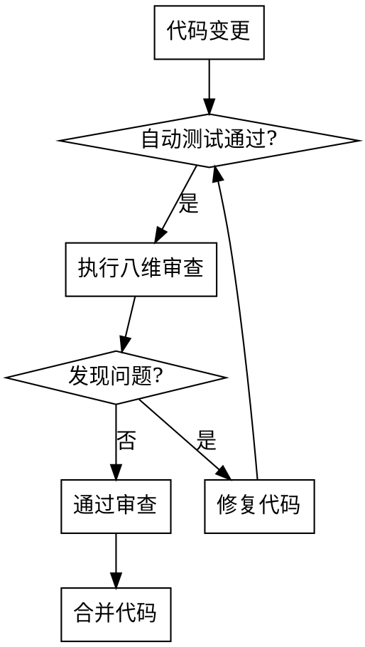

# Reviewing Python Code

## Overview

系统化的 Python 代码质量审查流程，确保代码符合 PEP 8/PEP 257 规范和 Python 社区最佳实践。

**核心方法论：八维审查法** - 从功能正确性、性能、安全性、并发、设计、风格、可读性、可测试性 8 个维度全面评估代码质量。

**核心原则：**

1. **业务价值优先** - 代码必须准确实现需求规格
2. **Pythonic 风格** - 遵循 Python 社区最佳实践和设计哲学
3. **长期可维护** - 代码应该像散文一样易读
4. **安全可靠** - 预防安全漏洞和资源泄漏

## When to Use

✅ **使用场景：**

- 提交代码前进行自我审查
- 合并 PR 前进行代码审查
- 发现代码质量问题（性能、安全、可维护性）
- 验证代码是否符合 Python 编码规范
- 重构代码前进行质量评估

❌ **不适用于：**

- 非 Python 项目（使用相应的代码审查规范）
- 简单脚本（可跳过全面审查）
- 仅格式检查（使用自动工具如 black、flake8）

## Quick Reference

| 审查维度 | 核心检查项 | 工具支持 |
| :--- | :--- | :--- |
| **功能正确性** | 边界条件、异常处理、输入验证 | pytest |
| **性能效率** | 算法复杂度、资源管理、性能瓶颈 | cProfile, memory_profiler |
| **安全性** | 输入清理、敏感数据保护、依赖安全 | bandit, safety |
| **编码规范** | PEP 8、PEP 257、类型注解 | pylint, mypy, black |
| **设计质量** | SOLID 原则、模块化、接口设计 | - |
| **可测试性** | 纯函数、依赖注入、隔离性 | pytest, unittest.mock |

详见 [checklist.md](checklist.md) 获取完整检查清单。

## Review Workflow



## Coverage Standards

**审查覆盖要求：**

- ✅ **核心业务逻辑** - 必须逐行审查
- ✅ **公共 API** - 必须审查接口设计和文档
- ✅ **外部依赖** - 重点审查安全性
- ⚠️ **工具函数** - 可抽样审查
- ⚠️ **测试代码** - 可简化审查

## Review Tools

**自动检查工具：**

```bash
# 编码规范检查
pylint src/
flake8 src/
black --check src/

# 类型检查
mypy src/

# 安全检查
bandit -r src/

# 测试覆盖率
pytest --cov=src --cov-report=html
```

**手动审查要点：** 详见 [checklist.md](checklist.md)

## Detailed References

**完整检查清单：**

- **[checklist.md](checklist.md)** - 八维审查法的完整检查清单（180+ 项）

**相关规范：**

- **[PEP 8 -- Style Guide for Python Code](https://peps.python.org/pep-0008/)** - Python 编码风格指南
- **[PEP 257 -- Docstring Conventions](https://peps.python.org/pep-0257/)** - 文档字符串约定
- **[PEP 484 -- Type Hints](https://peps.python.org/pep-0484/)** - 类型注解规范
- **[The Zen of Python](https://peps.python.org/pep-0020/)** - Python 设计哲学（`import this`）

## Common Mistakes

| 错误 | 后果 | 修正 |
| :--- | :--- | :--- |
| 只审查代码风格 | 忽略深层质量问题 | 八维全面审查 |
| 过度关注细节 | 审查效率低 | 优先关注核心业务逻辑 |
| 使用主观标准 | 审查不一致 | 基于客观检查清单 |
| 忽略上下文 | 提出不合理建议 | 理解业务场景后再审查 |
| 审查过晚 | 修复成本高 | 在开发早期介入 |

## Red Flags - STOP and Re-review

- "这只是风格问题，不用改"
- "代码能运行就行"
- "时间紧迫，跳过审查"
- "这是临时代码，不用审查"
- "审查太慢了，影响进度"

**所有这些都意味着：停止当前审查，重新遵循完整的八维审查流程。**

## Review Principles

**审查者心态：**

1. **建设性批评** - 指出问题的同时提供改进建议
2. **尊重理解** - 理解业务场景和设计意图
3. **客观标准** - 基于规范和清单，而非个人偏好
4. **持续学习** - 审查也是学习机会

**不要做的：**

- ❌ 基于个人编程风格批评
- ❌ 提出未经验证的"优化"建议
- ❌ 忽略业务背景盲目套用原则
- ❌ 审查时带有情绪或偏见
