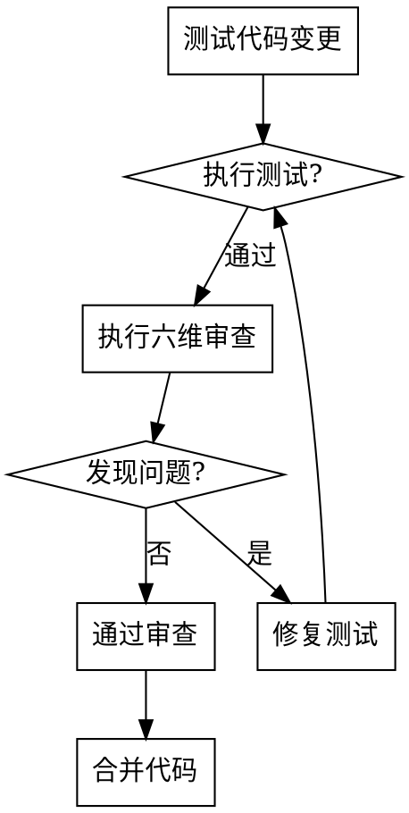

# Reviewing Python Test Code

## Overview

Python 测试代码审查技能专注于**确保测试的可信度和可维护性**。

**核心方法论：六维审查法** - 从需求覆盖、测试结构、断言质量、依赖隔离、FIRST 原则、框架规范 6 个维度全面评估测试质量。

**核心原则：**

1. **业务价值优先** - 测试必须保护关键业务需求
2. **真实性验证** - 测试应在代码有缺陷时失败
3. **可读性至上** - 测试代码应比实现代码更简单
4. **Python 生态** - 遵循 pytest/unittest 社区最佳实践

## When to Use

✅ **使用场景：**

- 审查包含测试代码的 PR
- 验证测试质量前合并到主分支
- 审计现有测试套件的可靠性
- 调试不稳定或不可靠的测试
- 为新项目建立测试标准
- 开发者入职 Python 测试最佳实践

❌ **不适用于：**

- 编写新测试（使用 `python-testing` 技能）
- 审查生产代码（使用 `python-code-review` 技能）
- 性能测试或负载测试场景

## Quick Reference

| 类别 | 关键检查 | 严重程度 |
| :--- | :--- | :--- |
| **覆盖率** | 核心逻辑 ≥90%，分支 ≥80% | 🔴 严重 |
| **AAA 模式** | Arrange-Act-Assert 结构 | 🔴 严重 |
| **断言** | 具体、最小化、每个测试一个 | 🟡 高 |
| **Mock 使用** | 状态验证 > 行为验证 | 🟡 高 |
| **FIRST** | Fast, Independent, Repeatable, Self-Validating, Timely | 🟡 高 |
| **命名** | `test_<function>_<condition>_<expected>` | 🟢 中 |

详见 [checklist.md](checklist.md) 获取完整检查清单。

## Review Workflow



## Coverage Standards

| 代码类型 | 目标覆盖率 |
| :--- | :--- |
| 核心业务逻辑 | > 90% |
| 工具/辅助函数 | > 80% |
| 分支覆盖率 | > 80% |
| **整体覆盖率** | **> 85%** |

**覆盖率不能保证：**

- ❌ 测试质量（通过的测试不等于好测试）
- ❌ 边界条件覆盖（100% 覆盖率也可能遗漏边界）
- ❌ 业务逻辑正确性（验证的是代码路径，非业务需求）
- ❌ 异常场景处理（正常路径覆盖不代表异常处理正确）

## Review Tools

**测试质量检查：**

```bash
# 运行测试并检查覆盖率
pytest --cov=src --cov-report=html --cov-report=term-missing

# 检查测试代码质量
pytest --flake8 --pylint

# 生成测试报告
pytest --html=report.html --self-contained-html

# 标记慢速测试
pytest -m "not slow" -v
```

**Mock 验证：**

```bash
# 检查 mock 使用
pytest --mock-trace
```

## Detailed References

**完整检查清单：**

- **[checklist.md](checklist.md)** - 六维审查法的完整检查清单（150+ 项）

**测试模式：**

- **[AAA Pattern](references/patterns.md)** - Arrange-Act-Assert 测试结构
- **[FIRST Principles](references/first.md)** - Fast, Independent, Repeatable, Self-Validating, Timely
- **[Pytest Best Practices](references/pytest.md)** - pytest 框架最佳实践

## Common Mistakes

| 错误 | 后果 | 修正 |
| :--- | :--- | :--- |
| 测试实现细节而非行为 | 脆弱测试，重构时失败 | 聚焦公共接口和可观察行为 |
| 过度 Mock 导致测试脆弱 | 测试通过但代码不可用 | 优先状态验证，减少行为验证 |
| 断言过于宽泛（`assert result is not None`） | 假阳性 | 使用具体的断言方法 |
| 测试间共享状态 | 顺序依赖，难以调试 | 使用 fixture 独立环境 |
| 忽略边界条件 | 生产环境异常 | 测试 None、0、空集合、极值 |
| 魔法数字和硬编码 | 可读性差 | 使用具名常量和参数化 |

## Red Flags - STOP and Re-review

- "测试太简单，肯定能通过"
- "我已经手动测试过了"
- "先写代码，回头再补测试"
- "测试通过就行，不用管覆盖率"
- "需求很明确，不用分析了"

**所有这些都意味着：停止当前审查，重新遵循完整的六维审查流程。**

## Test Quality Examples

### ❌ Bad: 测试实现细节

```python
def test_calculate_discount():
    result = calculate_discount(100, "vip")
    assert result._discount_rate == 0.2  # 测试私有字段
    assert result._final_price == 80     # 脆弱的实现细节
```

### ✅ Good: 测试公共行为

```python
def test_user_gets_20_percent_discount_when_vip_member():
    # Arrange: 准备测试数据
    price = 100
    user_type = "vip"

    # Act: 执行被测行为
    result = calculate_discount(price, user_type)

    # Assert: 验证业务行为
    assert result == 80  # VIP 用户享受 8 折
```

**为什么优秀：**

- ✓ AAA 结构清晰
- ✓ 命名规范（`test_<function>_<condition>_<expected>`）
- ✓ 具体断言（非 `assert result is not None`）
- ✓ 验证业务价值，非实现细节
