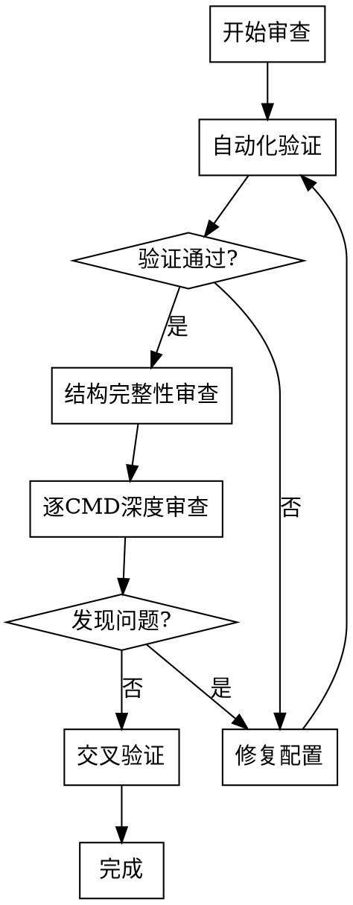

# YAML 协议配置审查

系统化的 YAML 协议配置审查流程，通过**多视角交叉验证**确保配置质量。

## Overview

本技能提供系统化的 YAML 协议配置审查流程，通过**多视角交叉验证**确保配置质量。核心价值在于发现人工难以察觉的配置错误，特别是字段定义、循环结构、枚举映射等问题。

**核心原则：**

1. **独立视角** - 审查时不依赖配置过程的记忆，重新从文档读取
2. **逐 CMD 验证** - 每个 CMD 独立审查，避免批量审查导致遗漏
3. **双向对照** - 文档→配置 和 配置→文档 双向检查
4. **自动化优先** - 优先使用工具验证，人工审查作为补充

## When to Use

✅ **使用场景：**

- 用户请求审查、验证或检查 YAML 协议配置
- 配置文件刚创建或修改后需要质量保证
- 发现解析错误需要定位配置问题
- 需要验证配置与文档的一致性
- 用户提到"配置审查"、"YAML验证"、"协议检查"等关键词

❌ **不适用于：**

- 用户在创建新配置（应使用 `/protocol-to-yaml`）
- 用户在转换文档格式（应使用文档提取工具）

## Quick Reference

| 阶段 | 重点关注 | 快速检查 |
| :--- | :--- | :--- |
| **自动化验证** | 语法、类型、枚举 | 运行 `python main.py --validate` |
| **结构完整性** | CMD 覆盖率、基础配置 | 对比文档和配置 |
| **逐 CMD 深度审查** | 字段定义、循环结构 | 使用检查清单 |
| **交叉验证** | 枚举值、类型定义 | 抽样验证 |
| **边界情况** | 字节对齐、值域 | 计算验证 |

详见 [checklist.md](checklist.md) 获取完整检查清单。

## Review Workflow



## Quick Validation

**自动化语法验证：**

```bash
# 验证所有协议配置
python main.py --validate

# 验证单个协议配置
python main.py --validate configs/v8/protocol.yaml

# 运行解析测试
python main.py <protocol_name>
```

## Review Phases

### 阶段一：自动化验证

首先执行配置语法验证工具。

**检查点：**
- [ ] 配置文件语法正确
- [ ] 所有引用的类型都已定义
- [ ] 所有引用的枚举都已定义
- [ ] 循环引用的 id 字段存在

如果有测试日志，执行协议解析测试。

**检查点：**
- [ ] 解析过程无报错
- [ ] 所有 CMD 都能被识别
- [ ] 输出文件正常生成

### 阶段二：结构完整性审查

**CMD 覆盖率检查：**

1. 读取协议文档，提取所有 CMD 列表
2. 读取 YAML 配置，提取已配置的 CMD 列表
3. 对比检查：
   - [ ] 文档中的 CMD 是否都已配置
   - [ ] 配置中是否有文档中不存在的 CMD
   - [ ] CMD 编号是否一致

**基础配置检查：**

- [ ] `meta.protocol` 名称与目录名一致
- [ ] `meta.default_endian` 设置正确
- [ ] `compatibility.head_len` 与文档描述一致
- [ ] `compatibility.tail_len` 与文档描述一致
- [ ] `frame_head` 与文档描述一致
- [ ] `head_fields` 各字段 offset 和 length 正确

### 阶段三：逐 CMD 深度审查（核心）

⚠️ **重要原则：**
1. **每次只审查一个 CMD**
2. **审查前必须重新读取该 CMD 对应的文档位置**
3. **使用检查清单逐项验证**
4. **发现问题立即记录，不要依赖记忆**

详见 [checklist.md](checklist.md) 获取字段级检查清单。

### 阶段四：交叉验证

- [ ] 枚举值映射正确（抽样验证）
- [ ] 类型定义完整（特别是 bitset/bitfield）
- [ ] 循环结构的引用字段存在

### 阶段五：边界情况检查

- [ ] 字节对齐检查（累加字段长度）
- [ ] 值域边界验证（scale 计算后的范围）
- [ ] 条件字段的所有分支都有定义

## Common Mistakes

| 错误类型 | 症状 | 快速诊断 |
| :--- | :--- | :--- |
| **字节长度错误** | 解析结果偏移 | 累加字段长度对比文档 |
| **字节序错误** | 数值大小异常（256→1） | 检查 endian 设置 |
| **循环次数错误** | 解析不完整或越界 | 验证 repeat_by 引用 |
| **枚举映射错误** | 状态显示不符 | 逐值对比文档 |
| **缩放因子错误** | 数值量级错误（2200V→220V） | 验证 scale 计算 |
| **条件字段遗漏** | 某些情况下字段未解析 | 检查 when 条件分支 |

## Detailed References

**完整检查清单：**

- **[checklist.md](checklist.md)** - 详细的字段级检查清单（包含配置规范速查）

**相关技能：**

- **[protocol-to-yaml](../protocol-to-yaml/SKILL.md)** - 协议文档到 YAML 配置的转换工作流

## Review Tools

**自动化验证：**

```bash
# 配置语法验证
python main.py --validate

# 单个协议解析测试
python main.py <protocol_name>

# 查看解析统计
python main.py <protocol_name> --stats
```

**手动验证要点：** 详见 [checklist.md](checklist.md)
