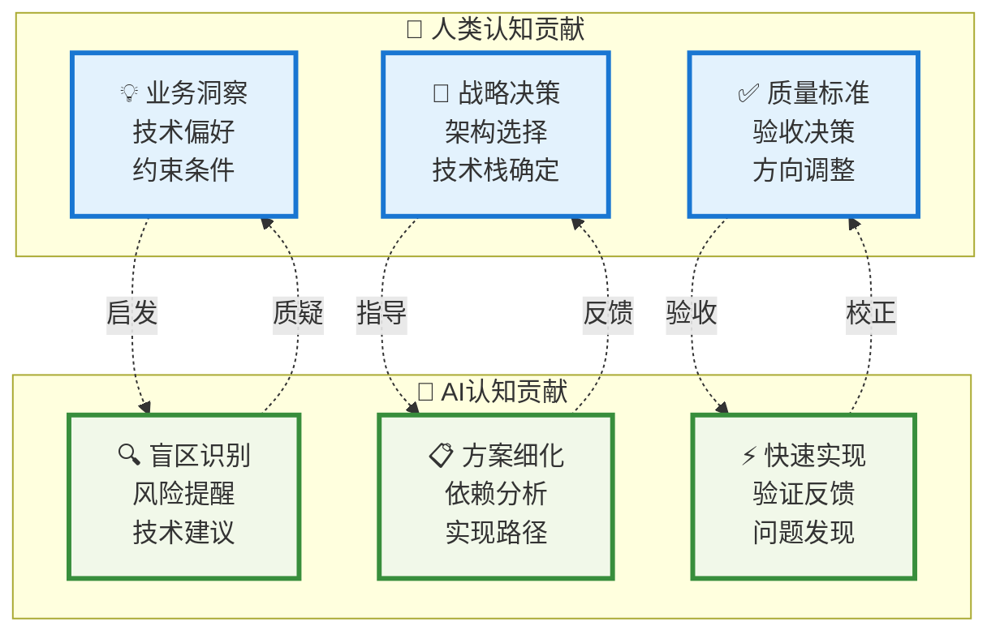
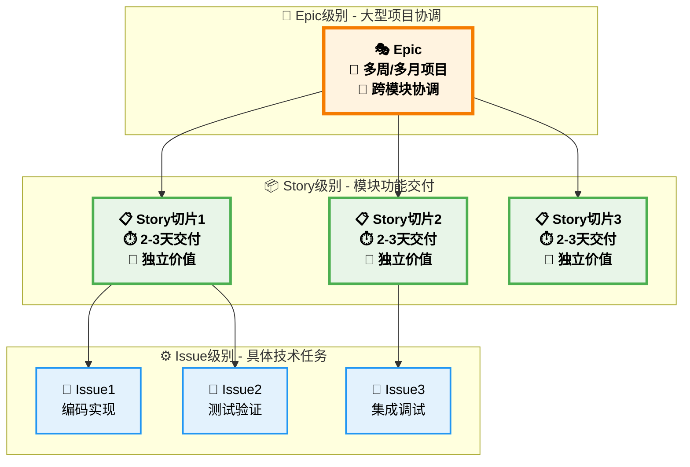
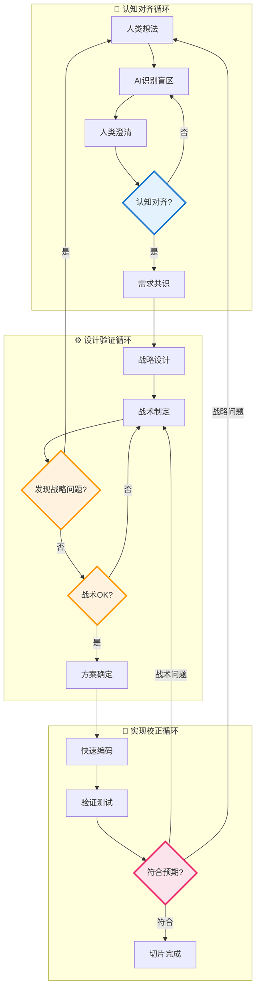
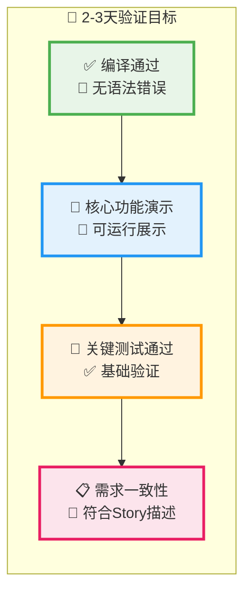

# AI-人类渐进式协作开发工作流

## 核心协作哲学

本工作流定义了一种真实的AI-人类协作模式，基于**认知碰撞**和**循环反馈**，旨在解决传统开发中的**需求偏移**和**实现偏离**问题。

### 🎯 三大核心原则

1. **认知碰撞 (Cognitive Collision):** AI和人类互相识别对方盲区，通过多轮交互达成真正的需求共识。
2. **循环验证 (Iterative Validation):** 战略-战术-实现之间存在反馈环，下层发现问题可回到上层重新设计。
3. **快速校正 (Rapid Correction):** 2-3天内必须看到可运行代码，用实现结果校正设计合理性。

### 🤝 真实协作模式：认知乒乓球

## 核心工作流设计

### 🏗️ 三层架构策略

### 🔄 真实协作循环：三重反馈机制

```mermaid
flowchart TD
    Start["🚀 开始"] --> Choice{"📊 项目规模判断"}
    
    subgraph "🌟 复杂项目路径 (20%)"
    Choice -->|大型/跨模块| EpicCreate["🎭 创建Epic<br/>📋 故事切片策略"]
    EpicCreate --> StorySlice["✂️ 分解Story切片<br/>🎯 每个2-3天完成"]
    end
    
    subgraph "📦 常规开发路径 (80%)"
    Choice -->|单模块功能| DirectStory["📋 直接创建Story<br/>🎯 明确功能边界"]
    end
    
    subgraph "💭 认知对齐循环 (想法→需求)"
    StorySlice --> CognitiveStart["🧠 人类想法表达<br/>💡 可能包含技术偏好"]
    DirectStory --> CognitiveStart
    CognitiveStart --> AIQuestion["🤖 AI深度提问<br/>🔍 识别盲区和缺失<br/>⚠️ 风险提醒"]
    AIQuestion --> HumanClarify["🧠 人类澄清补充<br/>📋 背景信息<br/>⚖️ 约束条件"]
    HumanClarify --> CognitiveCheck{"🤝 认知对齐?<br/>需求清晰?"}
    CognitiveCheck -->|否| AIQuestion
    CognitiveCheck -->|是| AlignedStory["📝 Story.md已对齐<br/>日志记录完整<br/>规格已定义"]
    end
    
    subgraph "⚙️ 设计验证循环 (战略→战术)"
    AlignedStory --> TechDialog["💬 技术方案对话<br/>🎯 针对当前切片<br/>🔧 接口设计讨论"]
    TechDialog --> IssueCreation["分解为具体Issue.md<br/>仅含目标和标准"]
    IssueCreation --> StrategicCheck{"🚨 发现战略问题?<br/>技术可行性质疑?"}
    StrategicCheck -->|是| CognitiveStart
    StrategicCheck -->|否| TacticalCheck{"✅ 战术方案OK?<br/>人类认可?"}
    TacticalCheck -->|否| TechDialog
    TacticalCheck -->|是| Dashboard["📈 生成Dashboard<br/>🔀 Issue拓扑排序<br/>⚡ 依赖识别"]
    end
    
    subgraph "🚀 实现校正循环 (战术→代码)"
    Dashboard --> RapidImpl["⚡ 快速实现<br/>在Issue日志中记录"]
    RapidImpl --> QuickTest["🧪 快速验证<br/>✅ 编译通过<br/>🎯 核心功能演示"]
    QuickTest --> ImplCheck{"🎯 实现符合预期?<br/>需求对齐?"}
    ImplCheck -->|战术问题| TechDialog
    ImplCheck -->|战略问题| CognitiveStart  
    ImplCheck -->|符合| NextSlice{"🔄 还有切片?"}
    end
    
    NextSlice -->|有| CognitiveStart
    NextSlice -->|无| Complete["🎉 功能完成"]
    
    subgraph "📚 交付文档阶段"
    Complete --> ModuleDocs["📄 编写模块文档<br/>📋 概览文档<br/>🔍 逻辑文档"]
    ModuleDocs --> FinalDelivery["🚀 正式交付"]
    end
    
    classDef startEnd fill:#fff3e0,stroke:#f57c00,stroke-width:4px,color:#000,font-weight:bold
    classDef process fill:#e3f2fd,stroke:#1976d2,stroke-width:3px,color:#000
    classDef decision fill:#fce4ec,stroke:#c2185b,stroke-width:3px,color:#000
    classDef human fill:#f3e5f5,stroke:#9c27b0,stroke-width:3px,color:#000
    classDef ai fill:#e8f5e8,stroke:#4caf50,stroke-width:3px,color:#000
    classDef loop fill:#fff8e1,stroke:#ffc107,stroke-width:4px,color:#000,font-weight:bold
    
    class Start,Complete,FinalDelivery startEnd
    class CognitiveCheck,StrategicCheck,TacticalCheck,ImplCheck,NextSlice decision
    class CognitiveStart,HumanClarify,TacticalCheck human
    class AIQuestion,AlignedStory,IssueCreation,Dashboard,RapidImpl,QuickTest,ModuleDocs ai
    class TechDialog loop
```

### 🔄 三重反馈机制详解

### ⚡ 快速验证标准

## 工作阶段与规则映射

### 📋 规则使用时机

| 阶段 | 主要工具/规则 | 使用频率 | 负责方 | 关键特点 |
|------|----------|----------|---------|----------|
| 认知/战略 | `story.md` 模板 | 每个Story | 人机协作 | 模板内置规则，过程记录于日志 |
| 任务规划 | `dashboard.mdc` | 每个Story | AI主导 | Issue依赖分析，执行排序 |
| 战术定义 | `issue.md` 模板 | 每个Issue | AI主导 | 定义任务目标与验收标准 |
| 战术执行 | `riper5.md` 执行协议 | 每个Issue | AI主导 | 结构化、可控的高质量交付 |
| 质量保证 | `coding_style.mdc`, `testing.mdc`, `code_review.mdc` | 每个Issue | AI/人类 | 贯穿实现与评审的全程 |
| 文档交付 | `module_overview_docs.mdc`, `module_logic_docs.mdc` | 功能完成后 | AI主导 | 从日志中自动生成文档 |

### 🎯 关键成功因素

1. **真实循环**：每个阶段都有向上反馈机制，避免错误累积
2. **认知碰撞**：AI和人类互相识别盲区，提升需求理解质量
3. **快速校正**：2-3天验证周期，用实现结果校正设计合理性
4. **分层验证**：战略、战术、实现三层相互校验

### 📊 使用场景分布

- **80% 常规开发**：直接Story → 三重循环 → 实现
- **20% 复杂项目**：Epic → Story切片 → 三重循环 → 实现

## 实践建议

### 🎯 人类关注重点

- **认知对齐阶段**：充分表达背景和约束，识别AI提出的盲区
- **设计验证阶段**：把握战略方向，评估技术方案的可行性
- **实现校正阶段**：及时验收，快速判断是否偏离预期

### 🤖 AI执行重点

- **认知对齐阶段**：深度提问，识别需求盲区和风险点
- **设计验证阶段**：细化技术方案，分析实现依赖和风险
- **实现校正阶段**：快速编码实现，主动反馈发现的问题

### ⚠️ 常见陷阱避免

- 避免假装"一次性沟通就对齐"，要通过多轮交互达成真正共识
- 避免"线性传递"思维，要利用反馈环及时校正上层设计
- 避免过长的设计周期，要通过快速实现验证设计合理性

### 🔄 反馈机制核心

- **向上反馈**：下层发现的问题要能够回到上层重新设计
- **平行反馈**：同一层的不同方案要能够相互比较和选择
- **向下验证**：上层的设计要通过下层的实现来验证可行性

遵循此真实协作模式，可以最大化AI-人类协作效能，确保高质量的软件交付。

## 🏁 人类验收 (Human Acceptance)
<!-- AI指南: 任务完成后，提醒人类进行验收。 -->
- [ ] **代码 Review**: [链接到相关 Code Review 或 Commit]
- [ ] **功能验收**: 确认 Issue 已满足所有【完成标准】。
- [ ] **最终确认**: [人类签字，例如: @lanford]

遵循此真实协作模式，可以最大化AI-人类协作效能，确保高质量的软件交付。

---

## 🏛️ 项目结构与约定

### 目录结构与命名规范

**⚠️ AI 强制要求：在创建任何新的 Milestone、Story 或 Issue 之前，必须先使用 `list_dir` 工具列出现有目录结构，检查已使用的 ID，避免 ID 冲突！**

- **里程碑 (Milestone):**
  - 位置: `memory-bank/open/`或`memory-bank/close/`
  - 命名: `M{id}_{Description}` (如: `M001_LogSnapshotMechanism`)
  - **AI 操作流程**: 先 `list_dir memory-bank/open` 和 `list_dir memory-bank/close` 检查已有 Milestone ID

- **史诗 (Epic):**
  - 位置: `memory-bank/open/M{id}_{MilestoneDescription}/epics/`
  - 命名: `epic{id}-{description}.md` (如: `epic01-user-authentication-system.md`)
  - **AI 操作流程**: 先 `list_dir memory-bank/open/M{id}_{MilestoneDescription}/epics/` 检查已有 Epic ID

- **用户故事 (Story):**
  - 位置: `memory-bank/open/M{id}_{MilestoneDescription}/stories/`
  - 命名: `story{id}-{description}.md` (如: `story01-user-login-via-email.md`)
  - **AI 操作流程**: 先 `list_dir memory-bank/open/M{id}_{MilestoneDescription}/stories/` 检查已有 Story ID

- **任务 (Issue):**
  - 位置: `memory-bank/open/M{id}_{MilestoneDescription}/issues/`
  - 命名: `issue{id}-{type}-{description}.md` (如: `issue01-feat-implement-connect-method.md`)
  - **AI 操作流程**: 先 `list_dir memory-bank/open/M{id}_{MilestoneDescription}/issues/` 检查已有 Issue ID

### 🚫 ID 冲突避免机制

1. **目录检查优先**：创建任何新文档前，必须先列出相关目录
2. **ID 递增规则**：新 ID = 当前最大 ID + 1
3. **错误预防**：发现 ID 冲突时，AI 必须重新选择合适的 ID
4. **强制验证**：每次 ID 分配后，再次检查确保无冲突
